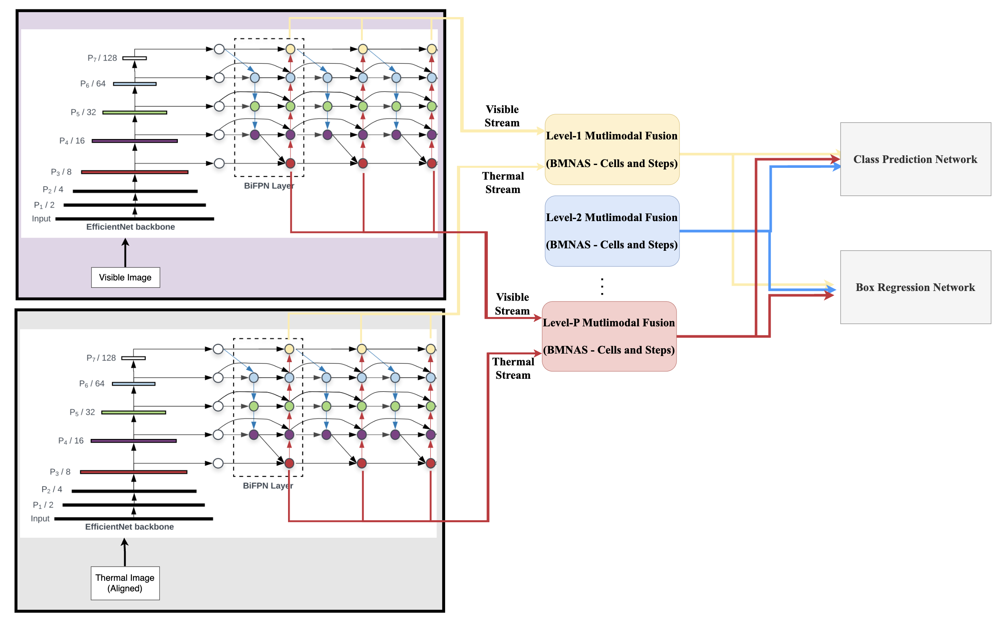

# Neural Architecture Search for Deep Sensor Fusion


Fusion of data from multiple sensors plays a pivotal role for improving the performance of object detection in autonomous vehicles. This becomes particularly relevant in adverse weather conditions because multimodal deep sensor fusion can exploit redundancies in multi-sensor data and perform better due to the fact that sensors can fail asymmetrically in such conditions. To this end, designing effective and efficient neural networks for multimodal feature fusion is extremely important for obtaining good performance. This handcrafted design by experts is typically task-specific and it requires a colossal number of computational resources, time, and memory to arrive at an optimal architecture. Automated Neural Architecture Search (NAS) is a promising area to explore to overcome these issues. However, optimizing a network for a job is a tedious task that requires lengthy search time, high processor needs, and a thorough examination of enormous possibilities. The need of the hour is to develop a strategy that saves time while maintaining an excellent level of accuracy in deep multimodal learning. In this project, we want to design, explore, and experiment with effective NAS methods for multimodal sensor fusion, in the task of object detection, which are also memory, time, and compute efficient.




## Requirements

Before starting, we will need the following software installed:

- Python
- Anaconda

We can create a new environment for replicating the experiments, using the given `nas_dsf_env.yml` file:

```
conda env create -f nas_dsf_env.yml
```

Then we can activate the environment using:

```
conda activate nas_dsf
```


## FLIR-Aligned Experiments

### Checkpoints

Download the pretrained model files of the backbone and head networks from the [link](https://drive.google.com/drive/folders/1S_hfku6aX1Bqmid8O1arLh4JvXWVzHsE?usp=sharing). Place the `checkpoints` folder as follows:

```
├── NAS-DSF
│   ├── checkpoints
│   ├── models
```

### Search Phase

To run the search phase experiments, do the following:

```shell
$ python main_darts_searchable_flira.py <dir of FLIR-Aligned Dataset> --batchsize=8 --epochs=10 --wandb
```

### Train Phase

To run the train phase experiments, do the following:

```shell
$ python main_darts_found_flira.py <dir of FLIR-Aligned Dataset> --search_exp_dir=<dir of search exp> --epochs=50 --batchsize=8
```

### Test Phase

To run the test phase experiments, do the following:

```shell
$ python main_darts_found_flira.py <dir of FLIR-Aligned Dataset> --search_exp_dir=<dir of search exp> --eval_exp_dir=<dir of search exp> --batchsize=8
```


